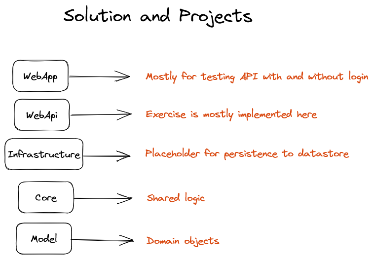
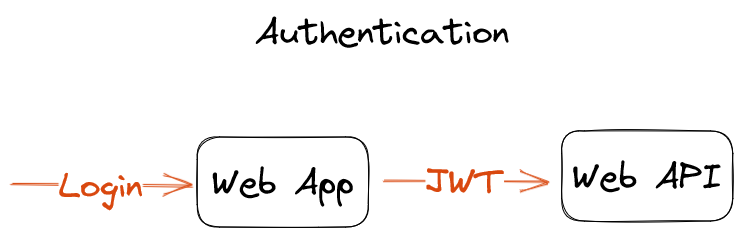
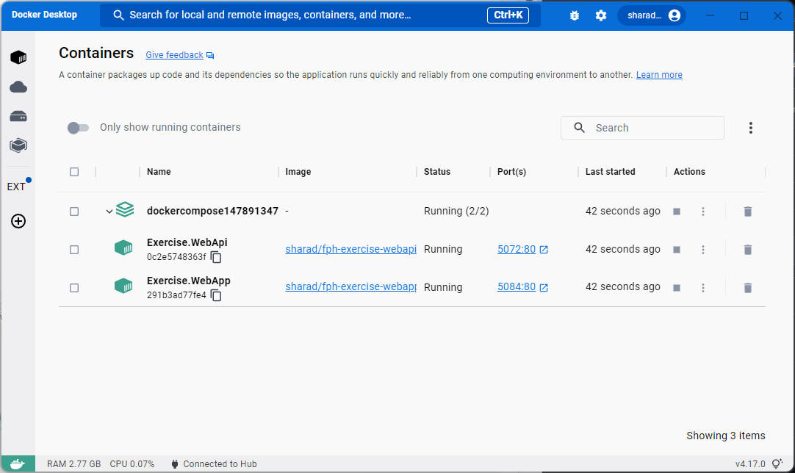
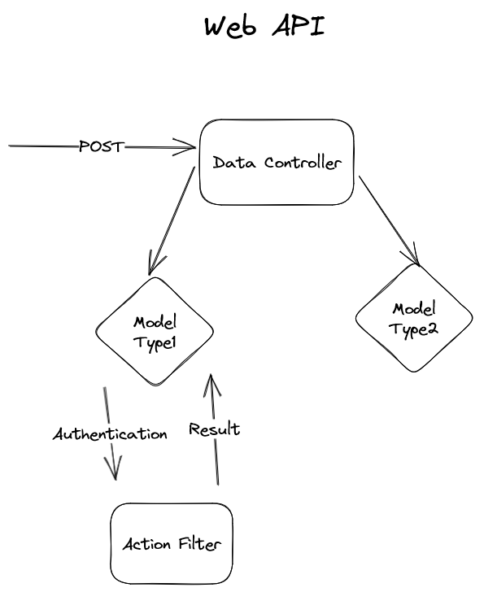

# FPH Exercise

Solution to the FPH coding exercise using .NET 6.0.

## Projects
* `Exercise.WebApp`: Test web app to test the API with and without login
* `Exercise.WebApi`: Most of the exercise is implemented here
* `Exercise.Infrastructure`: Placeholder for datastore logic
* `Exercise.Core`: Shared business logic
* `Exercise.Model`: Domain objects

## Authentication

The test web app has a login function, which authenticates the user. Later the authentication from the web app is used to authenticate with the web API. Web API uses JWT, which is created and passed by the web app.

The web app is purely for testing.

## Docker

Both the web API and the web app are Dockerized. This is using `docker compose` to start two projects in separate containers, where the app has access to API.

## Web App

The web app is the functional test project. You can run the web app.

* `Model1` calls the Web API with `DenyUnlessLoggedIn = false`
* `Model1-with-login` requires authentication, and calls the Web API with `DenyUnlessLoggedIn = true`
* `Model1-without-login` Calls the Web API with 
`DenyUnlessLoggedIn = true` but without authentication
* `Model2` calls the second Web API `POST` method 

## Web API

* `AuthController` implements simple JWT authentication
* `DataController` implements the requirements from the exercise with two `POST` methods
* `ModelType1` method allows both `DenyUnlessLoggedIn = true` and `DenyUnlessLoggedIn = false`
* `ModelType2` method doesn't require `DenyUnlessLoggedIn` flag

## Filters

* `AsyncActionFilter` implementation is used to implement the requirements for the exercise
* `AsyncAuthorizationFilter` 
* All filters are added to the pipeline from `Program.cs` 

# Tests

* `Exercise.Unit.Tests` implements unit tests for the important parts of the business logic
* `Exercise.Integration.Tests` implements the integration tests using `WebApplicationFactory`
* `Exercise.WebApp` is the functional test project

